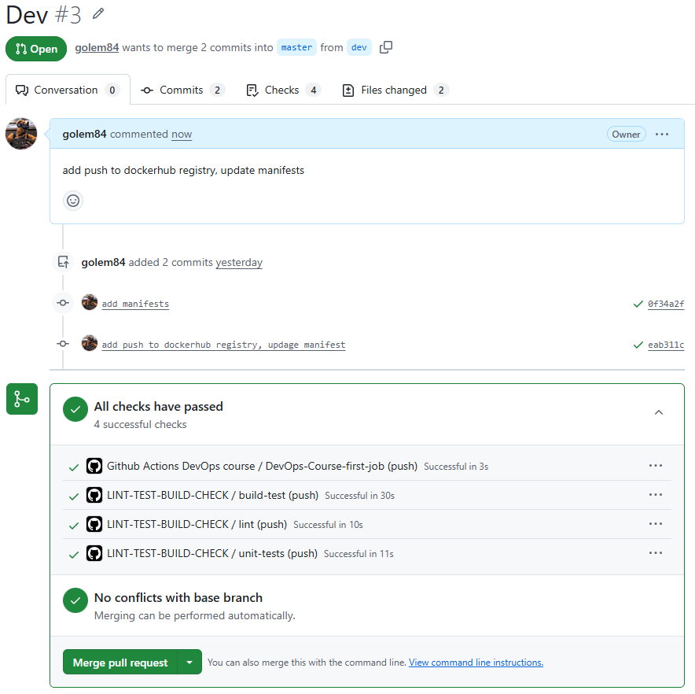
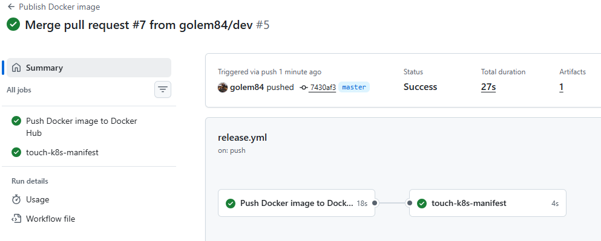
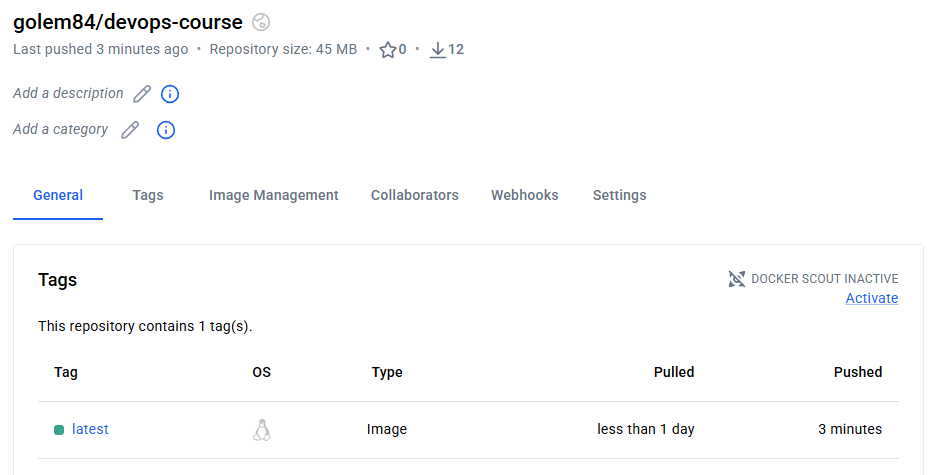
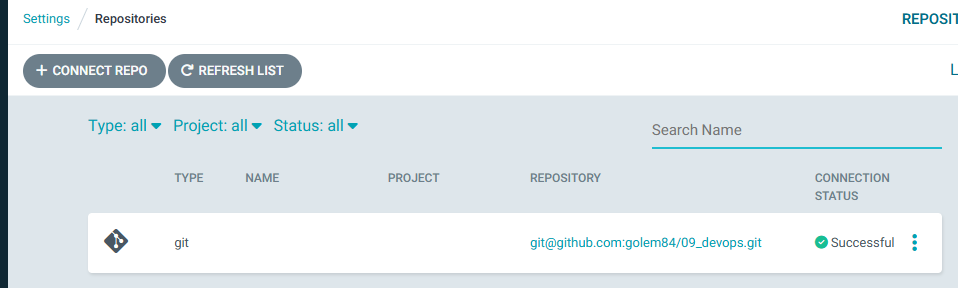
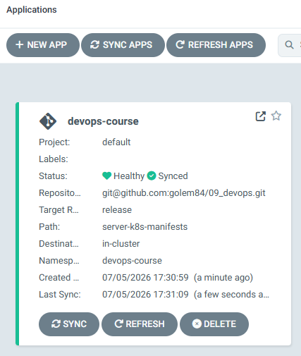
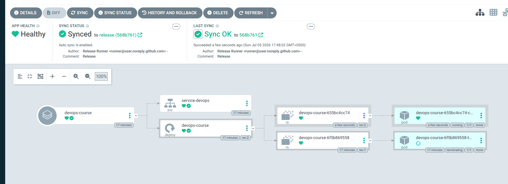
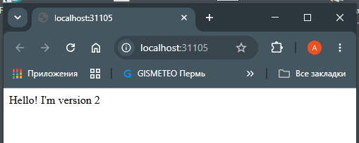

# Лаб. 9 CI/CD в кластер kubernetes с DockerHub и ArgoCD

## 0. Подготовка

Создаем репозиторий, инициализируем с веткой master, создаем ветку dev, далее работаем в этой ветке.  
В корне репозитория создаем папку и файлы будущего приложения python:
```bash
sysadmin@master:~/labs/09_devops$ tree
.
├── requirements.txt
└── server
    ├── application.py
    ├── dockerfile
    └── test_application.py
```
содержимое requirements.txt
```txt
pylint
pytest
```
содержимое application.py
```python
import http.server
import socketserver

PORT = 8000

class TestMe():
    def take_four(self):
        return 5        # намеренно делаем ошибку для проверки тестов
    def port(self):
        return PORT

if __name__ == '__main__':
    Handler = http.server.SimpleHTTPRequestHandler

    with socketserver.TCPServer(("", PORT), Handler) as http:
        print("serving at port", PORT)
        http.serve_forever()
```
содержимое dockerfile  
```dockerfile
FROM python:3.7-slim

RUN mkdir -p /usr/local/http-server

RUN useradd runner -d /home/runner -m -s /bin/bash

WORKDIR /usr/local/http-server

ADD ./application.py /usr/local/http-server/application.py

RUN chown -R runner:runner /usr/local/http-server/

EXPOSE 8000
USER runner
CMD ["python3", "-u", "/usr/local/http-server/application.py"]
```
содержимое test_application.py
```python
import pytest

from application import TestMe

def test_server():
    assert TestMe().take_four() == 4

def test_port():
    assert TestMe().port() == 8000
```
Делаем push в github.  

## 1. Пайплайны

### 1.1. пайплайн для проверки функционала  

В настройках github должна быть активирована возможность запуска пайплайнов.  
Создаем папку ./.github/workflows, в ней создаем файл devops_course_pipeline.yml  
```yml
name: Github Actions DevOps course
on: push
jobs:
    DevOps-Course-first-job:
        runs-on: ubuntu-latest
        steps:
          - run: echo "I run my first Github Actions"
          - name: Show uptime
            run: uptime
          - name: Where am I?
            run: pwd
          - name: Who am I?
            run: whoami
```
Данная job будет срабатывать при каждом push в любую ветку репозитория, выполняет: 
- аптайм раннера
- текущую директорию раннера
- имя текущего пользователя на раннере

### 1.2. Защита ветки master  

Для ветки master выполняем настройку через Ruleset: push в ветку разрешено только при помощи Pull Request, напрямую запрещено (Require pull request before merging, target branch: master)  
Для переноса кода в master потребуется из интерфейса github создать pull request и подтвердить его, тем самым сливая ветку dev в ветку master  

Пушим ветку dev на сервер, проверяем работу первого пайплайна:  


### 1.3. Сборка и тестирование приложения

добавляем новый пайплайн в ./.github/workflows/cicd.yml
```yml
name: LINT-TEST-BUILD-CHECK
on:
    push:
        # запускается только в ветке dev
        branches: [ dev ]

jobs:
    # проверка кода python линтером
    lint:
        runs-on: ubuntu-24.04
        steps:
        - uses: actions/checkout@v4
        - uses: actions/setup-python@v5
          with:
            python-version: '3.10'
        - run: pip install -r requirements.txt; pylint server/application.py
    # тестирование кода приложения
    unit-tests:
        runs-on: ubuntu-24.04
        steps:
        - uses: actions/checkout@v4
        - uses: actions/setup-python@v5
          with:
            python-version: '3.10'
        - run: pip install -r requirements.txt; pytest --junitxml=junit/test-results.xml
    # тестирование сборки приложения в docker
    build-test:
        needs: [ lint, unit-tests ]
        runs-on: ubuntu-24.04
        steps:
        - uses: actions/checkout@v4
        - run: docker build -t test-image ./server --file ./server/dockerfile
        - run: docker run -d --name app-server8000 -p 8000:8000 --restart unless-stopped test-image
        - run: sleep 11
        - run: docker ps -a
        - run: sleep 11
        - run: 'curl 127.0.0.1:8000'
```
делаем push на сервер github и проверяем пайплайн с линтером, тестами и сборкой.
После устранения ошибок линтера и в тестах создаем PR в master:  


## 2. Публикация образа в dockerhub и манифесты для kubernetes

### 2.1. готовим хранилище dockerhub

создаем учетную запись на dockerhub, создаем публичный репозиторий `golem84/devops-course`, этот репозиторий укажем в будущем манифесте как получатель образов для пайплайна и источник образов для кластера.  
Создаем токен для github. Токен добавляем в настройках репозитория github в разделе Settings -> Secrets and variables -> Actions. Указываем две переменные и присваиваем значения:
- DOCKER_USERNAME
- DOCKER_TOKEN

### 2.2. Манифесты для приложения и сервиса

в файле ./server-k8s-manifests/devops-course.yml описываем манифесты приложения и сервиса:  
```yml
apiVersion: apps/v1
kind: Deployment
metadata:
  name: devops-course
  labels:
    app: devops-course
    # здесь будем прописывать новое значение через пайплайн
    release-date: RELEASE-DATE
  namespace: devops-course
spec:
  replicas: 1
  selector:
    matchLabels:
      app: devops-course
  template:
    metadata:
      labels:
        app: devops-course
        svc: frontend
        release-date: RELEASE-DATE
    spec:
      containers:
      - name: devops-course-server
        # указываем образ в репозитории dockerhub
        image: golem84/devops-course:latest
        # пока образа в dockerhub нет, используем
        # imagePullPolicy: IfNotPresent
        # заменить на эту строку после первой публикации образа в dockerhub
        imagePullPolicy: Always
        ports:
        - containerPort: 8000
---
apiVersion: v1
kind: Service
metadata:
  name: service-devops
  labels:
    app: devops-course
  namespace: devops-course
spec:
  type: LoadBalancer
  selector:
    app: devops-course
    svc: frontend
  ports:
  - port: 12345
    targetPort: 8000
  externalIPs:
    - 10.0.2.15
```
### 2.3. Пайплайн для сборки и публикации образа в dockerhub

добавляем файл пайплайн для сборки и публикации ./.github/workflows/release.yml
```yml
name: Publish Docker image

on:
  push:
    # только для ветки master
    branches: [ master ]

permissions:
  # требуются разрешения на запись
  contents: write

jobs:
  push_to_registry:
    name: Push Docker image to Docker Hub
    runs-on: ubuntu-24.04
    steps:
      - name: Check out the repo
        uses: actions/checkout@v4

      - name: Log in to Docker Hub
        uses: docker/login-action@v3
        with:
          # используем переменные из 2.1
          username: ${{ secrets.DOCKER_USERNAME }}
          password: ${{ secrets.DOCKER_TOKEN }}

      - name: Build and push Docker image
        id: push
        uses: docker/build-push-action@v6
        with:
          context: ./server/
          push: true
          # указываем репозиторий для публикации
          tags: ${{ secrets.DOCKER_USERNAME }}/devops-course:latest

  touch-k8s-manifest:
    # после успешного push
    needs: [ push_to_registry ]
    runs-on: ubuntu-24.04
    steps:
      - uses: actions/checkout@v4
      - name: Insert release date
        # меняем RELEASE-DATE в манифесте на реальную дату...
        run: 'sed -i "s/release-date: .*$/release-date: s`date +%s`/g" ./server-k8s-manifests/devops-course.yml'
      
      # и коммитим изменения в ветку release
      - name: Commit manifest
        run: |
          git config --global user.name 'Release Runner'
          git config --global user.email 'runner@user.noreply.github.com'
          git commit -am "Release"
          git push --force origin master:release
```
делаем push в репозиторий github, выполняем merge в master и проверяем работу пайплайна для публикации образа в dockerhub  
  
Проверяем, что свежий образ приложения загружен на dockerhub  
  
## 3. Установка и настройка ArgoCD

### 3.1. Установка ArgoCD

выполняем на хосте master (minikube уже запущен):  
```bash
$ kubectl create namespace argocd  
$ kubectl apply -n argocd -f https://raw.githubusercontent.com/argoproj/argocd/stable/manifests/install.yaml
# дожидаемся что все модули будут доступны
$ kubectl get deployments -n argocd
NAME                               READY   UP-TO-DATE   AVAILABLE   AGE
argocd-applicationset-controller   1/1     1            1           57s
argocd-dex-server                  1/1     1            1           57s
argocd-notifications-controller    1/1     1            1           57s
argocd-redis                       1/1     1            1           57s
argocd-repo-server                 1/1     1            1           57s
argocd-server                      1/1     1            1           57s
```

Пробрасываем сервисы argocd api наружу:  
```bash
$ kubectl patch svc argocd-server -n argocd -p '{"spec": {"type": "LoadBalancer"}}'
$ kubectl patch svc argocd-server -n argocd -p '{"spec": {"externalIPs": [ "10.0.2.15" ]}}'
```
Пробрасываем порт 50001 хоста на 443 порт master для взаимодействия с Argocd в интерфейсе VirtualBox.  
Получаем пароль администратора ArgoCD:  
```bash
$ kubectl -n argocd get secret argocd-initial-admin-secret --template={{.data.password}} | base64 -d
```
и входим в панель управления argocd.

### 3.2. Настройка ArgoCD на работу с репозиторием и кластером

Приватный ключ для управления репозиторием берем из файла ./.ssh/id_ed25519 (вместе со строками ---BEGIN OPENSSH PRIVATE KEY---, ---END OPENSSH PRIVATE KEY---), должен быть без парольной фразы (не требовать дополнительный пароль при открытии соединения).  
Подключаем репозиторий к ArgoCD с использованием ключа
connect to repo via ssh from argocd
  
Настраиваем кластер - подключаем манифесты из репозитория, указываем папку с манифестами и ветку release, адрес кластера и namespace.  
Дожидаемся развертывания приложения в кластере.  
  

## 4. Проверка CI/CD  

в ветке dev вносим изменения в репозиторий: добавляем файл index.html в папку ./server
```html
Hello! I'm version 2
```

делаем git push, создаем pull request и мерджим ветку dev в master.
Производится автоматически:
- проверка линтером кода приложения на python
- тестирование кода python
- проверка сборки docker образа
- загрузка свежего образа в dockerhub
- корректировка манифестов в ветке release
- автоматический деплой новой версии приложения в кластер  

Наблюдаем процесс в ArgoCD: старые версии получают статус Terminated, новые - Healthy  


Открываем доступ к сервису из внешней сети и проверяем в командной строке: 
```bash
sysadmin@master:~$ minikube service service-devops -n devops-course
┌───────────────┬────────────────┬─────────────┬───────────────────────────┐
│   NAMESPACE   │      NAME      │ TARGET PORT │            URL            │
├───────────────┼────────────────┼─────────────┼───────────────────────────┤
│ devops-course │ service-devops │ 12345       │ http://192.168.49.2:32157 │
└───────────────┴────────────────┴─────────────┴───────────────────────────┘
🎉  Opening service devops-course/service-devops in default browser...
👉  http://192.168.49.2:32157
sysadmin@master:~$
sysadmin@master:~$
sysadmin@master:~$ curl http://192.168.49.2:32157
Hello! I'm version 2
```
Проверяем работу приложения из браузера хоста Windows  
  

## Примечание:  
В ходе выполнения лабораторной работы было замечено, что ArgoCD успешно синхронизирует приложение (`Synced` / `Healthy`), однако в визуальном дереве ресурсов у сервиса `service-devops` отсутствуют дочерние элементы `Endpoints` и `EndpointSlice`. Состояние сервиса "Progressing".

### Причина поведения:
Данное поведение является **штатным и ожидаемым** для текущей конфигурации манифеста:
1. По условию лабораторной работы для интеграции с сетью VirtualBox используется сервис типа `LoadBalancer` с принудительным указанием статического IP-адреса через механизм `spec.externalIPs` (IP: `10.0.2.15`).
2. В локальном кластере отсутствует полноценный облачный контроллер или локальный балансировщик (например, MetalLB), который должен динамически заполнять поле `status.loadBalancer.ingress`.
3. Поскольку трафик маршрутизируется напрямую через `externalIPs` на уровне правил iptables/IPVS самой ноды, интерфейс ArgoCD для такой специфической конфигурации не отображает классические дочерние объекты `Endpoints` на графе связей.
